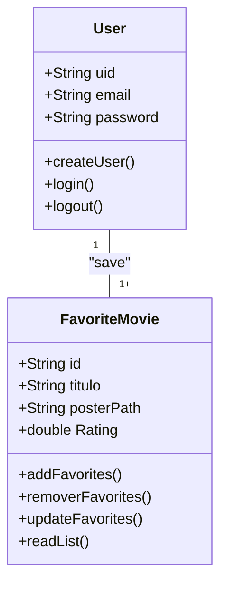

# CineFavorie - Formativa
Construir um Aplicativo do zero - O CineFavorite permitirá criar uma conta e buscar fimes em uma API e montar uma galeria pessoal de filmes favoritos, com posters e notas

## Objetivos
- Criar uma Galeria personalizada por usuário de filmes favoritos
- Conectar o APP com uma API (Base de dados) de filmes
- Permitir a criação de contas para cada usuário
- Listar filmes por palavras chaves

## Levantamentos de Requisitos do Projeto
- ### Funcionais
    - Salvar flmes
    - Criar contas

- ### Não Funcionais

## Recursos do Projeto
- Flutter / Dart 
- Firebase (Authentication / FireStore DataBase)
- API TMDB
- Figma
- VSCode

## Diagramas

1. ### Classes
    Demonstrar o funcionamento das entidades do sistema
    - Usuário (User) : classe já modelada pelo FirebaseAuth
        - email
        - password
        - uid
        - login()
        - create()
        - logout()

    - FilmeFavorito : Classe modelada pelo dev
        - number:id
        - String:Titulo
        - String:Poster
        - double:Rating
        - adicionar()
        - remover()
        - listar()
        - updateNota()


2. ### Uso
    Ações que os atores podem fazer
    - User: 
        - Registrar
        - Login 
        - Logout
        - Procurar Filmes API
        - Salvar Filmes Favoritos
        - Dar Notas aos Filmes
        - Remover dos Favoritos

```mermaid

grapth TD
    subgraph "Ações"
        uc1([Register])
        uc2([Login])
        uc3([LogOut])
        uc4([Search Movie])
        uc5([Favorite Movie])
        uc6([Rating Movie])
        uc7([Remove Favorite Movie])
    end

    user([Usuário])

    User --> uc1
    User --> uc2
    User --> uc3
    User --> uc4
    User --> uc5
    User --> uc6
    User --> uc7

    uc1 --> uc2
    uc2 --> uc3
    uc2 --> uc4
    uc2 --> uc5
    uc2 --> uc6
    uc2 --> uc7

```

3. ### Fluxo
    Determina o caminho percorrido pelo ator para executar uma ação

    - Ação de Login

```mermaid

graphTD

    A[Ínicio] --> B{Login Usuário}
    B --> C[Inserir Email e Senha]
    C --> D{Validar Credenciais}
    D --> E[SIM]
    E --> F[Tela de Favoritos] 
    D --> G[NÃO]
    G --> B

```

## Prototipagem

## Codificação